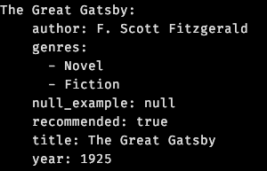

# to

CLI & Python package to convert or diff between JSON, YAML, TOML, JSON5 and literal Python collections.

## Examples

Given a json file `example.json`:

```json
{
  "The Great Gatsby": {
    "title": "The Great Gatsby",
    "author": "F. Scott Fitzgerald",
    "year": 1925,
    "null_example": null,
    "recommended": true,
    "genres": ["Novel", "Fiction"]
  }
}
```

### `to convert -f yaml`
    $ to.py convert example.json -f yaml



### `--clean` `--pretty` options

    $ to.py convert example.json -f toml --clean --pretty
The `--clean` flag removes the `null_example` key with a `null` value.

The `--pretty` flag formats the output and prints it with syntax highlighting with `rich`.


## Usage

### to.py
```
usage: to.py [-h] {convert,diff} ...

Convert or compare between json, json5, toml, yaml.

positional arguments:
  {convert,diff}
    convert       Convert between different formats.
    diff          Convert two files or data to FORMAT, then diff the result.

options:
  -h, --help      show this help message and exit
```
———————

#### `to convert`
```
usage: to.py convert [-h] -f {json,json5,toml,yaml} [-o OUTPUT] [--width WIDTH] [--sort-keys] [--clean] [-p] [input]

positional arguments:
  input                 Input string, file path, '-' for stdin. Can be omitted if piping data into the script (default: -)

options:
  -h, --help            show this help message and exit
  -f {json,json5,toml,yaml}, --format {json,json5,toml,yaml}
                        Output format (default: None)
  -o OUTPUT, --output OUTPUT
                        Output file path or 'stdout' for standard output (default) (default: stdout)
  --width WIDTH         Width for yaml output (default: 120) (default: 120)
  --sort-keys           Sort keys in the output (default: True) (default: True)
  --clean               Clean the output before writing (default: False)
  -p, --pretty          Pretty print the output (default: False)
```
———————

#### `to diff`
```
usage: to.py diff [-h] [-o OUTPUT_OR_TOOL] -f {json,json5,toml,yaml} [-q] [--ignore-order] [--ignore-empty] [--ignore-space] input1 input2

positional arguments:
  input1                Input string, file path, '-' for stdin.
  input2                Input string, file path, '-' for stdin.

options:
  -h, --help            show this help message and exit
  -o OUTPUT_OR_TOOL, --output OUTPUT_OR_TOOL
                        Choices: an output file path, or diff, delta, code, pycharm. If an output file path: write the output of coreutils 'diff' to this path. 'diff': print the output of coreutils' diff to
                        stdout (default). A diff program — 'delta', 'code' or 'pycharm': view the diff with the respective tool. (default: diff)
  -f {json,json5,toml,yaml}, --format {json,json5,toml,yaml}
                        Convert inputs to this format before diffing. (default: None)
  -q, --quiet           Do not print the diff to stdout, only return 0 for no difference, 1 for difference. (default: False)
  --ignore-order        Ignore order of keys when diffing. (default: False)
  --ignore-empty        Do not count a missing key as different from an empty value. (default: False)
  --ignore-space        Ignore differences in whitespace. (default: False)
```
